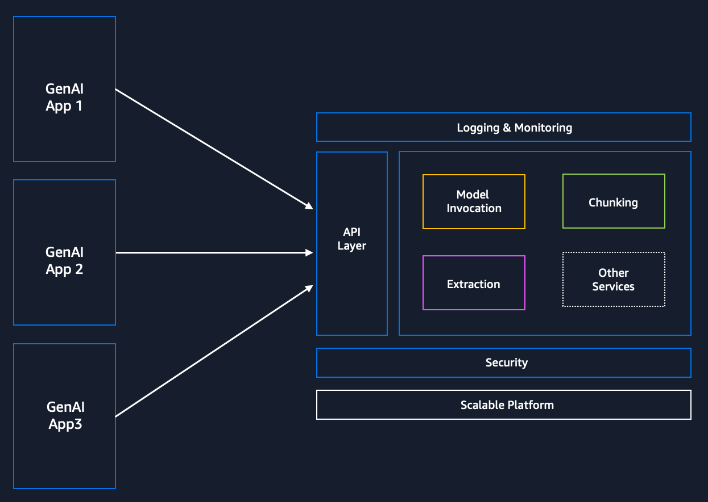
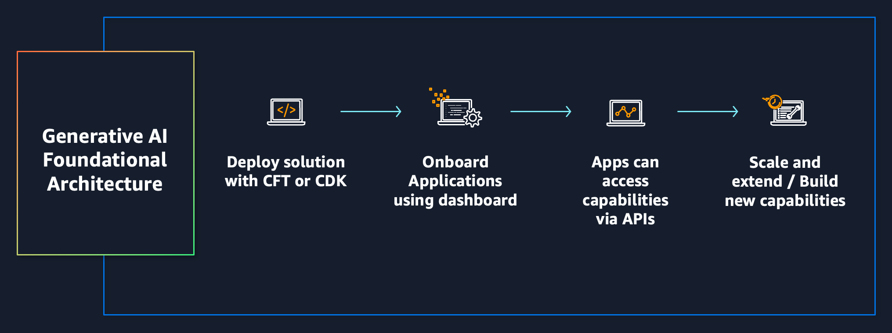
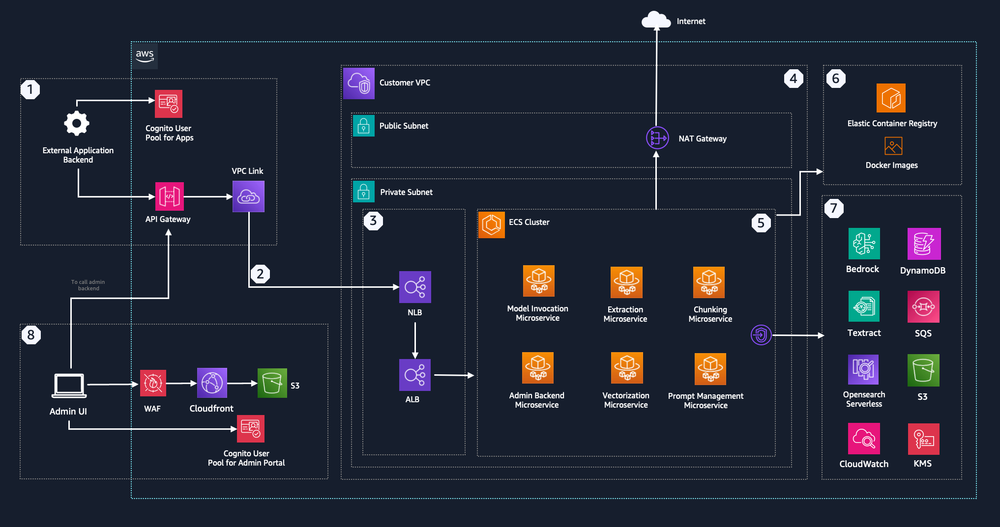
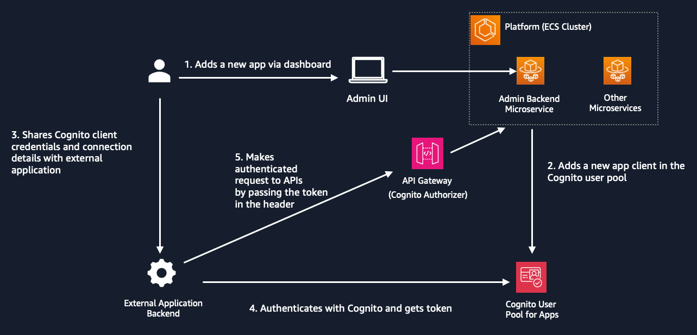

# Generative AI Applications Foundational Architecture

> Please note that this deployment works on us-east-1 and us-west-2 regions.

## Table of contents
- [Overview](#Overview)
- [How It Works](#How-It-Works)
- [Architecture](#Architecture)
- [Admin Journey](#Admin-Journey)
- [External Application Journey](#External-Application-Journey)
- [Microservices Overview](./docs/microservices.md)
- [API Docs](./docs/api_docs/)
- [Implementation Guide](./docs/implementation.md)
- [Admin Portal Walkrhough](./docs/adminportal.md)
- [Usage Examples](./cookbook/)

## Overview 

This repository provides a sample setup for a centralized microservices-based architecture designed to simplify the complexities of developing and deploying Generative AI applications. It offers a layer of abstraction that streamlines development workflows, reduces code redundancy, and enhances scalability.

This architecture is intended for developers, data scientists, and enterprises looking to build and scale Generative AI applications efficiently. It is especially beneficial for teams that require modular, scalable, and maintainable solutions for handling various aspects of Generative AI.

### Benefits

- **Efficient Development**: Simplifies and accelerates the development process with modular microservices.
- **Scalability**: Ensures scalable solutions with independent development and deployment of services.
- **Reduced Redundancy**: Minimizes code duplication by providing reusable components.
- **Enhanced Flexibility**: Offers flexible integration and customization to meet diverse application needs.

## How It Works 

The architecture works by offering a set of [microservices](./docs/implementation.md), each handling specific functions such as model invocation, prompt management, vectorization text extraction and chunking. These microservices are deployed as Fargate tasks on an ECS cluster, exposing APIs via API Gateway for secure and efficient communication.

External applications can leverage the API endpoints to add capabilities. The platform can be used as a foundational layer to add more microservices or extend the functionality. Please refer to [API Docs](./docs/api_docs/) to see the list of available APIs.

The architecture can be deployed via CDK application or Cloudformation Templates. The architecture also includes a Admin UI Portal that Admins can use to onboard external applications on to the platform (provide access to the APIs). 

### Workflow:

1. **Authentication**: External applications authenticate with Cognito using client credentials and fetch the access token.
2. **API Requests**: External applications send API requests to the API Gateway, along with token in the header
2. **Service Invocation**: The API Gateway verifies the token and routes requests to the appropriate microservice.
3. **Processing**: The microservice processes the request (e.g., invoking a model, managing prompts, extracting data).
4. **Response**: The processed data is sent back to the external application via the API Gateway.

## Architecture 

### Overview

This architecture encompasses various components, including microservices, storage, and authentication mechanisms, to support scalable and secure operations. The diagram below illustrates how external applications and administrative interfaces interact with the platform's microservices and supporting AWS services.

### Key Components
1. **API Gateway**: Facilitates secure communication between the external applications and the platform.
2. **ECS Cluster**: Hosts various microservices, including Model Invocation, Extraction, Chunking, Vectorization, Prompt Management, and Admin Backend Microservice.
3. **Customer VPC**: This Virtual Private Cloud (VPC) hosts the infrastructure, providing a secure network environment.
4. **NLB (Network Load Balancer)**: Recieves REST API requests from API Gateway via VPC Link and forwards it to an Application Load Balancer
5. ***ALB (Application Load Balancer)***: Employs path based routing to distribute traffic across microservices on ECS.
6. **Elastic Container Registry (ECR)**: Stores Docker images for the microservices.
7. **Supporting AWS Services**: Includes services like Bedrock, DynamoDB, Textract, SQS, Opensearch Serverless, CloudWatch, S3, and KMS for various functionalities like LLM invocation, logging, storage, search, monitoring, and security.
8. ***Amazon Cognito***: Provides token-based authorization and secures the incoming requests to the architecture. Also provides authentication for the Admin Portal.
9. **Admin UI**: Provides an interface for administrators to manage application access to the API and track usage (more details in the Admin UI section). Admin UI is hosted in S3, delivered via CloudFront and secured by Cognito for user authentication.
10. ***WAF***: Web Application Firewall secures the Admin UI and prevents malicious attacks

### Data Flow

1. **External Application Interaction (1)**
    - External applications authenticate via the Cognito User Pool for Apps.
    - Authenticated requests are routed through the API Gateway, which establishes a secure connection to the internal services using a VPC Link.
2. **Internal Network Communication (2)**
    - The VPC Link connects the API Gateway to the Customer VPC, where the core infrastructure resides. It forwards the requests to NLB deployed in the private subnet of the customer VPC via private link.
3. **Load Balancing (3)**
    - The Network Load Balancer (NLB) forwards incoming traffic to the ALB.
    - The Application Load Balancer (ALB) further manages traffic using path based routing to ensure efficient service delivery.
    - For more details on NLB to ALB architecture, refer to this link.
4. **VPC (4)**
    - VPC hosts a public and private subnet. Private subnet hosts the load balancers and the ECS cluster itself. Public subnet enables egress only communication with public resources on the internet. 
    - The NAT Gateway provides a secure way for instances in the private subnet to access reources on the internet. This is useful for Generative AI applications which need to call external APIs or access public resources on the internet. This outbound path to internet is optional. It can be restricted or optionally be routed via Network Firewall.
5. **Microservices (ECS Fargate Tasks) (5)**
    - Microservices accept authenticated incoming requests, process the requests and send a reponse. Each microservice exposes a set of API endpoints that can be accessed by authenticated external applications. For more details on microservices, please refer to [Microservices](./docs/implementation.md) section. For a full list of API endpoints see [API Docs](./docs/implementation.md).

    Microservices include:
      - **Model Invocation Service**: Standardizes and logs LLM invocation (supports only Bedrock currently).
      - **Layout Aware Extraction**: Extracts data with an understanding of document layouts for better contextual processing.
      - **Prompt Management**: Handles creating and versioning of prompts, enables dynamic prompt injection at runtime.
      - **Indexing and Vectorization**: Creates embeddings at scale, streamlines vectorization (supports only OpenSearch Serverless currently).
      - **Chunking Service**: Chunks files at scale for vectorization.
      - **Admin Dashboard Backend**: Supports the admin UI with necessary backend operations.
6. **Container Management (6)**
    - Docker images for the microservices are stored in private Elastic Container Registry (ECR) repositories, enabling deployment and scaling within the ECS Cluster.
7. **Integration with AWS Services (7)**
    - Microservices utilize AWS services like DynamoDB for data storage, Textract for document extraction, SQS for message queuing, and Opensearch Serverless for search functionalities. The communication between microservices and AWS services happens privately via VPC endpoints.

    Microservices communicate with various AWS services including,
      - **Amazon DynamoDB**: Provides a fast and flexible NoSQL database for application data like invocation logs, extraction and chunking jobs and prompt templates
      - **Amazon SQS**: Ensures reliable and scalable message queuing for microservices.
      - **Amazon CloudWatch**: Used for logging
      - **Amazon Textract**: Extracts text and structured data from documents for processing.
      - **Amazon OpenSearch Serverless**: Offers serverless vector storage and semantic search capabilities.
      - **Amazon Bedrock**: Supports foundational AI models.
8. **Administrative Interface (8)**
    - The Admin UI, hosted via CloudFront, provides a management interface for administrators.
    - Administrators authenticate using the Cognito User Pool for Admin Portal.

### Data Storage and Content Delivery

- **Amazon S3**: Stores static assets for the Admin UI and generated outputs.
- **Amazon CloudFront**: Serves Admin Portal UI assets with low latency and high transfer speeds.

## Authentication Flow

External applications authenticate with Cognito and interact with the microservices through API requests. Administrators can use the Admin UI to onboard applications, monitor activity, and scale services. Admin portal provides connection details to the admin (Cognito client ID, domain and user pool ID) that can be shared with external application. Cognito client secret is not exposed via the UI. It’s stored in secrets manager. Admin can share the secret via offline channels or provide IAM based access to the secret (to external application).

After authenticating with Cognito and fetching access token, applications send requests through API Gateway, which are routed to the appropriate microservices within the VPC. Microservices process the requests, leveraging AWS services, and send responses back to the external applications. The architecture supports secure communication, efficient load balancing, and integration with various AWS services for storage, logging, and Generative AI capabilities.

>Recommendation: For robust and secure authentication and authorization, it is highly recommended to use OAuth 2.0 / OpenID Connect or an equivalent protocol. These protocols provide a standardized way to handle authentication and authorization, ensuring your application is secure and can easily integrate with various identity providers.

## Admin Journey 

1. **Login**: Admins log in to the Admin Portal using Amazon Cognito authentication.
2. **Dashboard Access**: Access the admin dashboard to view and manage resources.
3. **Onboard Applications**: Onboard new applications that will interact with the services.
4. **Monitor Activity**: Use Admin Dashboard and CloudWatch for monitoring application activity, performance and logs.
6. **Scale Services**: Manage and scale microservices as needed via the ECS cluster and ECR.

## External Application Journey 

1. **Authenticate**: External applications authenticate using tokens provided by Amazon Cognito.
2. **Send Requests**: Send API requests via Amazon API Gateway.
3. **Service Interaction**: Interact with various microservices (e.g., model invocation, data extraction) through secure API endpoints.
4. **Receive Responses**: Receive processed data or responses from the microservices.
5. **Handle Data**: Use the returned data for further processing or user-facing features in the external application.
6. **Monitor and Scale**: Continuously monitor application performance and scale interactions as needed to ensure optimal functionality.

## Security

#### Data protection in transit

All interactions between microservices and AWS services are done using AWS SDK, which uses TLS1.2+. The bucket policy denies non-secure transport access to the buckets created. The CloudFront endpoint deployed for UI uses HTTPS.

Solution leverages with VPC endpoints for interaction with AWS services.

#### Data protection at rest

Following resources are encrypted:

* SQS queues - AWS Managed KMS key
* S3 buckets - SSE S3 encryption
* CloudWatch logs - AWS Managed KMS key
* Openserach Serverless -  AWS Owned KMS key
* Elasticache (Redis OSS) - AWS Owned KMS key

> DynamoDB tables are not encrypted and can be optionally be encrypted.

#### Security/trust boundaries

Service to service authentication uses IAM roles and policies. The microservices running in Amazon ECS uses IAM role to interact with other AWS services. This role has a custom policy restricting permissions to only required resources and actions, based on least privilege model.

#### Trust levels 

1. For Admin Portal:

Admin portal authentication uses Cognito User Pool. Once authenticated via Cognito hosted UI, the Admin UI relays the access token to the backend which sets a Http-only cookie (JWT). Subsequent communication with the backend is authenticated via JWT tokens in Http-only cookie.

2. External Applications accessing the platform:

Applications invoking API endpoints via API gateway are authenticated using a Cognito Authorizer configured on the API Gateway resources. Applications first authenticate with Cognito (M2M Authentication) and fetch an access token. Applications have to pass this access token in the header to access any APIs.

3. Microservices:

Microservices interact with AWS services using a taskExecution IAM role.

#### Authentication

The solution uses two Cognito User Pools. A Cognito User Pool for Admin UI authenticates Admins via username/password credentials (Cognito Hosted UI). An Admin is created by default when the solution is launched using CDK/CloudFormation. The password is emailed to the email that is used (input parameter) while deploying the CDK application/ CFT.

Applications invoking API endpoints via API gateway are authenticated using a Cognito Authorizer configured on the API Gateway resources. Applications first authenticate with Cognito (M2M Authentication) and fetch an access token. Applications have to pass this access token in the header to access any APIs.

#### Post Deployment Considerations
1. Add custom domain to API Gateway REST API and Cloudfront: The architecture uses default domains provided by Cloudfront and API Gateway. It is recommended that you use your own custom domain for production deployments. Please refer to the following documentation for adding a custom domain.
- API Gateway: https://docs.aws.amazon.com/apigateway/latest/developerguide/how-to-custom-domains.html
    - It is recommended that you choose TLS 1.2 or above for the security protocol: https://docs.aws.amazon.com/apigateway/latest/developerguide/apigateway-custom-domain-tls-version.html
- Cloudfront: https://docs.aws.amazon.com/AmazonCloudFront/latest/DeveloperGuide/CNAMEs.html
    - Cloudfront security policy: https://docs.aws.amazon.com/AmazonCloudFront/latest/DeveloperGuide/distribution-web-values-specify.html#DownloadDistValues-security-policy
2. Scaling Microservices: By default the solution deploys only one task for each microservice. The microservices can be scaled to handle more requests by increasing the desired task count. Please refer to the following documentation: https://docs.aws.amazon.com/AmazonECS/latest/developerguide/service_definition_parameters.html#sd-desiredcount
    - You can optionally implement an auto scaling policy: https://docs.aws.amazon.com/AmazonECS/latest/developerguide/service-auto-scaling.html
3. DynamoDB Recovery and Backups: Solution does not implement backups or recovery strategies for DynamoDB tables used in the architecture. It's recommended you enable Point-in-time backups for production deployments: https://docs.aws.amazon.com/amazondynamodb/latest/developerguide/Backup-and-Restore.html