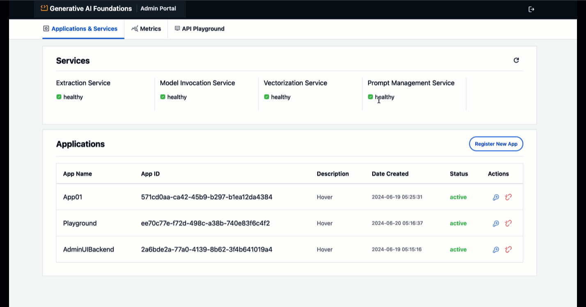

# Admin Portal Guide
Admin Portal is deployed as part of this Gen AI Foundational Architecture to enable easy status monitoring of deployed microservices, onboard new applications and also provides an API playground to try out the API end points.
After sucessful installation of the platform, you will be able to access the Admin Portal using Cloudfront Distribution URL.

#### Login to Admin Portal

Before you begin, ensure you have the following:

1. **Admin Email Address**: This is the email address you provided while deploying the CDK stack as part of the implementation steps.
2. **Password**: As part of implmentation, you must have received an email with temporary password. Use this for your initial login and then you will be prompted for password change.

Using these credentials, you will be able to login to admin portal.

#### Onboard Applications

Applications leveraging the API endpoints will need to be onbarded to enable secure coomunication between the application and platform's endpoints.
Endpoints are served via Amazon API Gateway which is secured by Amzaon Cognito  authorizer (JWT authorizer) to restrict unautorized requests from applications.

> Note: This implementaion uses Amzaon Cognito to authorize API requests from application. This can be swaped by any IDP that supports JWT based autorization for applications.
    
#### Monitor Status of microservices
Admin portal provides an easy and conveneitn way to keep a tab on deployed microservices and check their healt status as shown below.

#### Metrics Dashboard
Admin portal has a dedicated tab that displays metrics of various microserices tracted at application level. For instance we can view metrics like `# of invocations`, `Total Input Tokens` for model invocation service by application.

#### API Playground
Admin portal provides developers an easy way to try and test available endpoints before integrating them into application.

