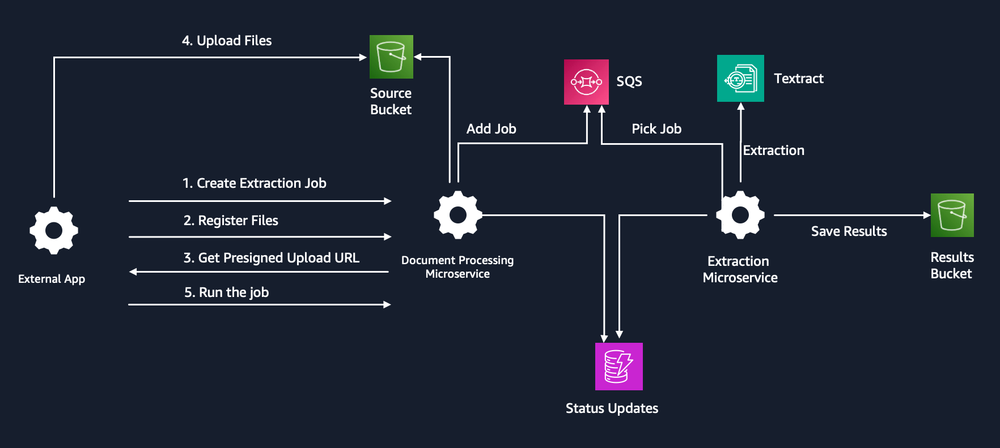
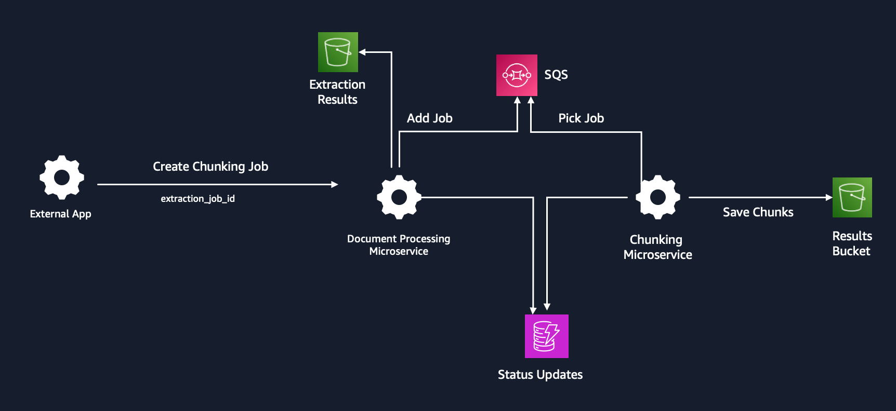

# Microservices Overview

Generative AI Foundational Platform hosts the following microservices, deployed as Fargate Tasks. It enables standardized invocation of LLMs on Bedrock, facilitates prompt management, and streamlines document processing through extraction, chunking, and vectorization workflows. These services offer a scalable and efficient way to enable Generative AI capabilities for applications.

Each microservice exposes a set of API endpoints accessible via the API gateway. For information on API endpoints, please refer to [API Docs](./api_docs).

### Model Invocation Service
***
The Model Invocation Service standardizes LLM invocation calls by auto-parsing inputs and outputs. Developers can call any LLM with a set of standard parameters. This service currently supports text-to-text and text-to-embed models on Bedrock.
Developers can use Model Invocation endpoints to:
- Invoke a model on Bedrock using a text prompt or a series of messages.
- Invoke a model on Bedrock asynchronously using a text prompt or a series of messages, returning an invocation ID to retrieve the result later (temporarily stored in Elasticache Redis).
- Invoke a model on Bedrock with raw input (refer to Bedrock documentation for JSON formats).
- Invoke embed models.

The service logs all function calls by app and model, tracks token usage, and provides access to this data through an admin portal.

### Document Processing Service
***

This service executes extraction and chunking workflows.

**Extraction Workflow**

Extracts text from documents while preserving layout information. Here's a high-level overview:

Process flow:
1. Create an extraction job and receive a Job ID.
2. Register files for extraction and receive a pre-signed URL for file upload.
3. Start an extraction job
4. Check the extraction job status.
5. Once the extraction job completes, obtain the results, including extracted text and tables, using S3 pre-signed URLs.

***

**Chunking Workflow**

The Chunking Service provides custom chunking strategies (by page, paragraph, character count) tailored to specific use cases, ensuring adaptability to varying requirements across the organization.
This service can be enhanced or expanded to include new chunking strategies, promoting standardization.

The chunking process takes a completed extraction job's ID as input, reads the extracted text, and creates chunks using the specified chunking strategy.

Process flow:
1. Create a chunking job for an extracted job and receive a Chunking Job ID.
2. Check the Chunking Job status.
3. Once the chunking job completes, obtain the results, including the pre-signed URL for the chunked file.

### Vectorization Service
***
The Vectorization Service facilitates the creation, management, and retrieval of vector representations of textual data, enabling efficient semantic search.

Process Flow:
1. Create a vector store and obtain the store ID for creating an index.
2. Check the vector store status and wait until it's active.
3. Create an index for the vector store and wait until it's active.
4. Trigger a vectorization job by passing the completed chunking job ID. This will vectorize each chunk and store it in the OpenSearch Serverless vector index.
5. Query the vector store for semantic search by passing the index ID and natural language query.

While the current implementation supports only OpenSearch Serverless, the solution is designed to be extensible, and additional vector databases can be onboarded in the future.

### Prompt Management Service
***
The Prompt Management Service facilitates management of Prompt Templates at scale. It supports versioning, easy retrieval, and dynamic prompt insertion.

1. Save and version prompt templates.
2. Get the latest version of a prompt template by name.
3. Get all versions of a prompt template by name.
4. Get a specific version of a prompt template by name and version.

### Admin Backend Service
***
The Admin Backend Service supports the [admin dashboard](../docs/adminportal.md), providing a centralized interface for monitoring and managing microservice status, invocation metrics, extraction jobs, token consumption, and errors.